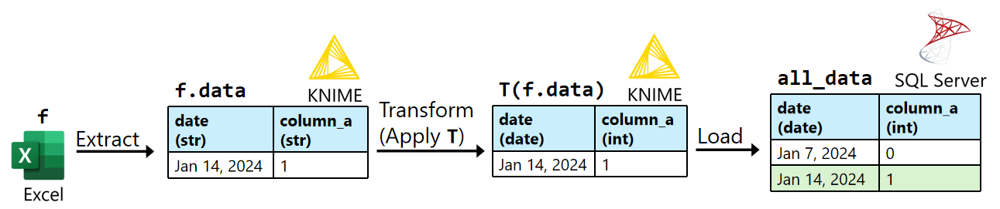
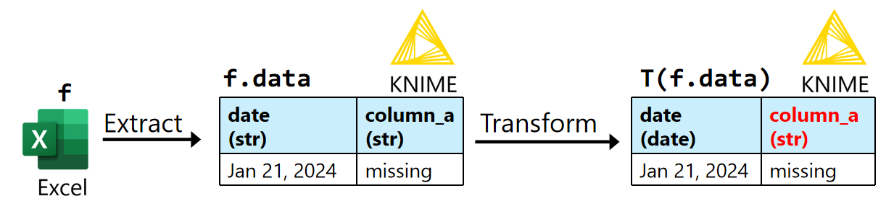
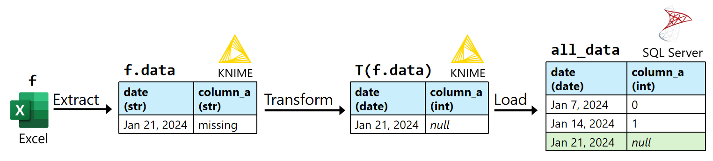

# Importing Tilray's data into a database

## Summary

{width="1000"}

!!! abstract ""
    :fontawesome-solid-triangle-exclamation: **Problem:** Every week, the analytics team received new financial and inventory data stored in Excel files. Over time, the analytics team collected thousands of Excel files. To facilitate data analysis, my manager asked me to import the data from the Excel files into the company's database.  

    :material-lightbulb-on-10: **Solution:** I used KNIME to develop an Extract, Transform, Load (ETL) program to extract the data from the Excel files, transform the data, then load the transformed data into SQL Server. Since many Excel files contained errors, I also implemented data quality tests to identify invalid data. 

    :octicons-graph-16: **Results:** The analytics team can now access all of the company's financial and inventory data using the company's database, instead of searching through thousands of Excel files.
    

## KNIME
KNIME is a low-code data processing application where you can chain “nodes” to create programs. A node is like a function in a programming language. 

{width="600"}
/// caption
Screenshot of KNIME.
///

## Definitions
{width="1000"}

`f`
:   An Excel file containing sales and inventory data for one week. 

`f.data`
:   The data table extracted from `f`. All columns in `f.data` are the string data type. 

`T`
:   A sequence of data transformations. These include:  

    - Transforming column contents using regular expressions.  
    - Converting column data types.  

`T(f.data)`
:   The resulting table after applying `T` to `f.data`. 

`all_data`
:   A database table that will store `T(f.data)` for every Excel file `f`.

**match**
:   A table `A` matches a table `B` if `A` and `B` have the same column names and data types.
    `T(f.data)` can only be loaded into `all_data` if `T(f.data)` matches `all_data`.

`all_file_names`
:   A set of all the Excel file names.

`loaded_file_names`
:   A set of the Excel file names `f.name` such that `T(f.data)` has been loaded into `all_data`. 

## Pseudocode of the ETL program (similar to Python)
<style>
.code {
    background-color: #f5f5f5; 
}
</style>


```
Algorithm ETL_program(file_names):  
    Input:   
        file_names: A set of Excel file names.
    Output: A dictionary of (file name, error message) items. 

    not_loaded_file_names = file_names.difference(loaded_file_names). 
    file_name_to_error_message = dict().

    for each Excel file name f.name in not_loaded_file_names:
	    f.data = Extract the data table from f.  
        try:
            T(f.data) = Apply each transformation in T to f.data. 
	        Load T(f.data) into all_data.
	    except Exception as error:
	        file_name_to_error_message[f.name] = str(error).   
	    else: 
	        Add f.name to loaded_file_names.
        
    return file_name_to_error_message.
```

<br>
After executing `file_name_to_error_message = ETL_program(all_file_names)`, I execute the following steps manually:

```
for f.name, error_message in file_name_to_error_message.items():
    Use error_message to update the data transformations in T. 
    Execute ETL_program(set(f.name)). 
```


## Example execution of the ETL program

`T`:
:   1. Convert `date` to the date data type.    
    2. Convert `column_a` to the integer data type.   

**1. Execute `ETL_program(set(f_1.name))`:**  

{width="800"}
/// caption
`T(f_1.data)` can't be loaded into `all_data` because `"missing"` in `column_a` can't be converted to an integer. 
///

**2. Update `T`:**  

`T`: 
:   1. Convert `date` to the date data type.    
    2. <span style="background-color:#d8f5e6">In `column_a`, replace all cells matching the regular expression `“^missing$”` with `null`.</span>
    3. Convert `column_a` to the integer data type.

**3. Execute `ETL_program(set(f_1.name))`:**    

{width="1000"}
/// caption
After updating `T`, `T(f_1.data)` is loaded into `all_data`.
///
